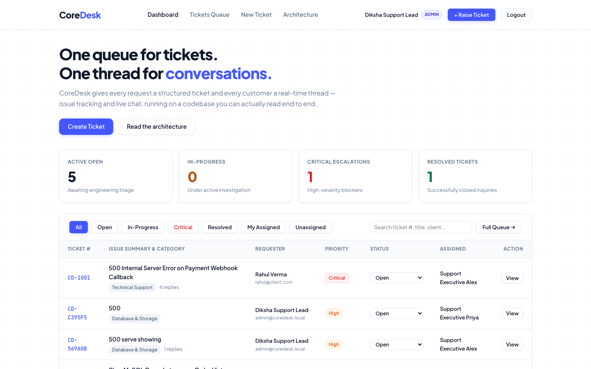
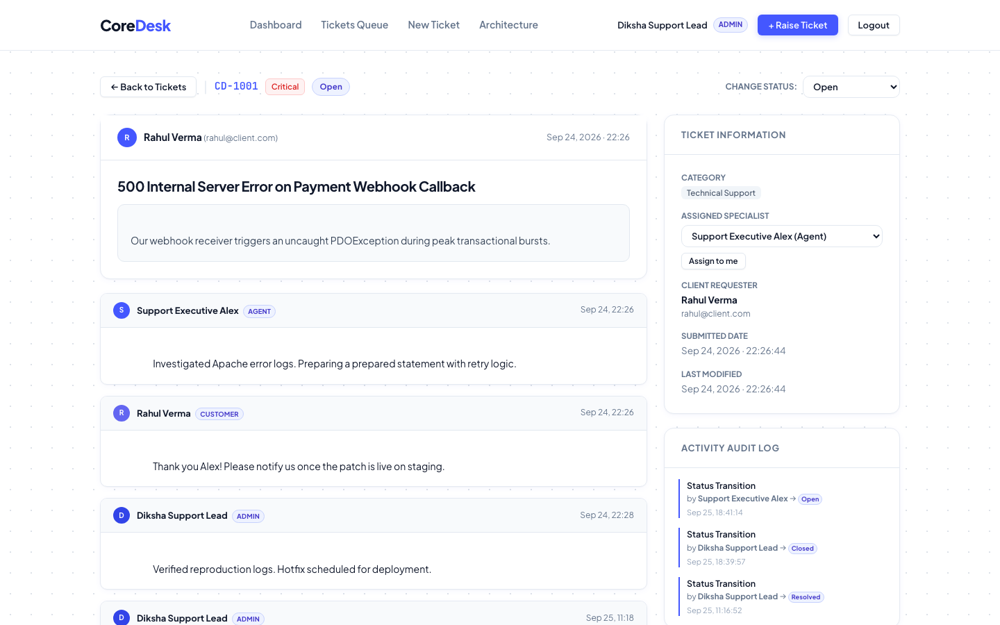
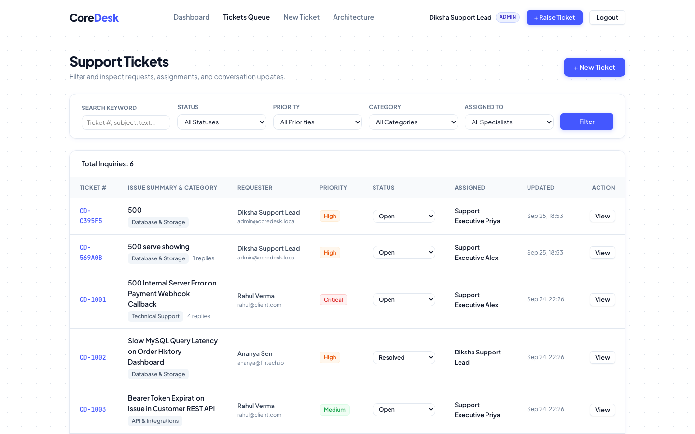
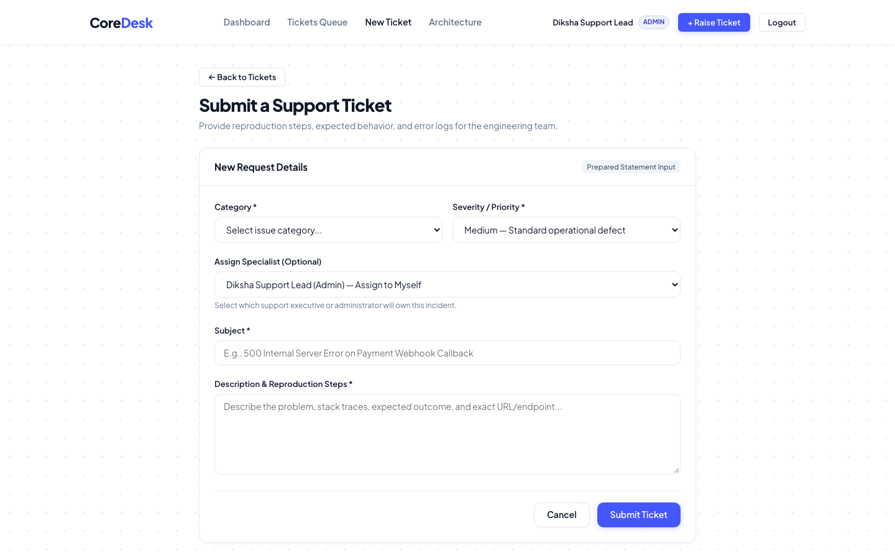
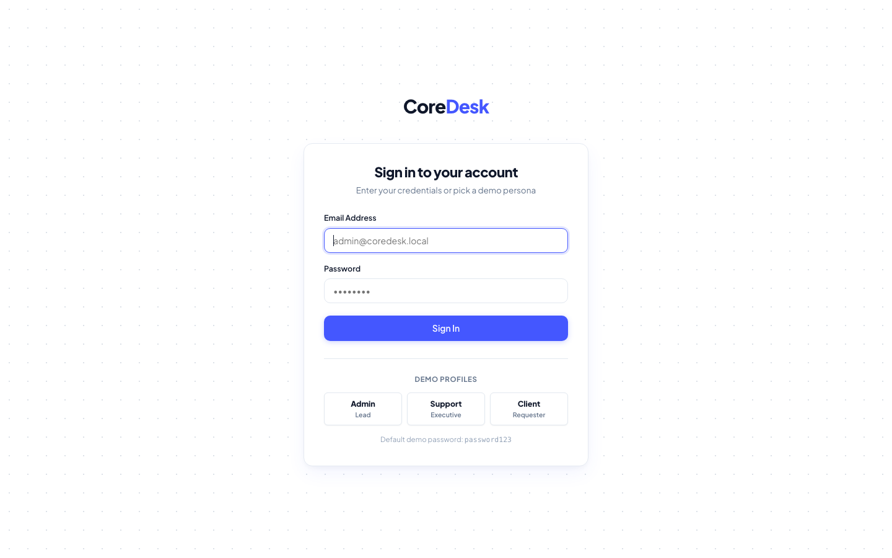
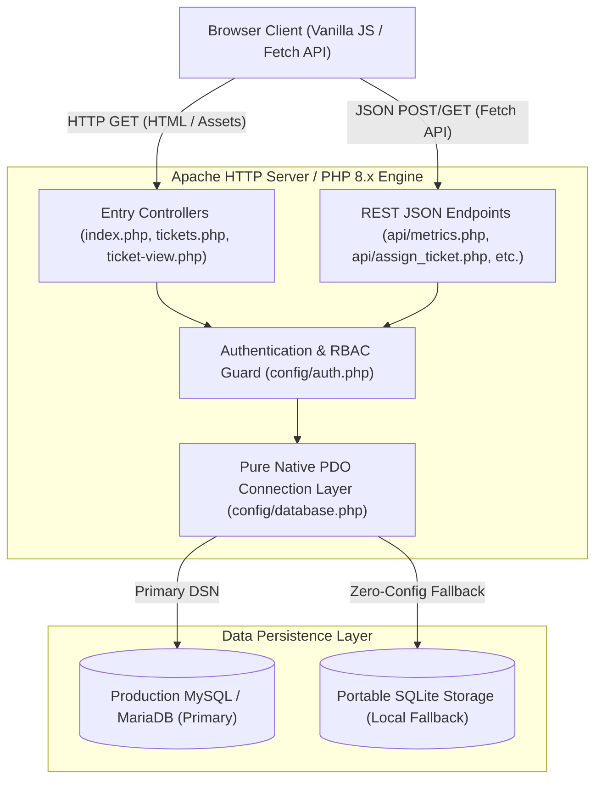
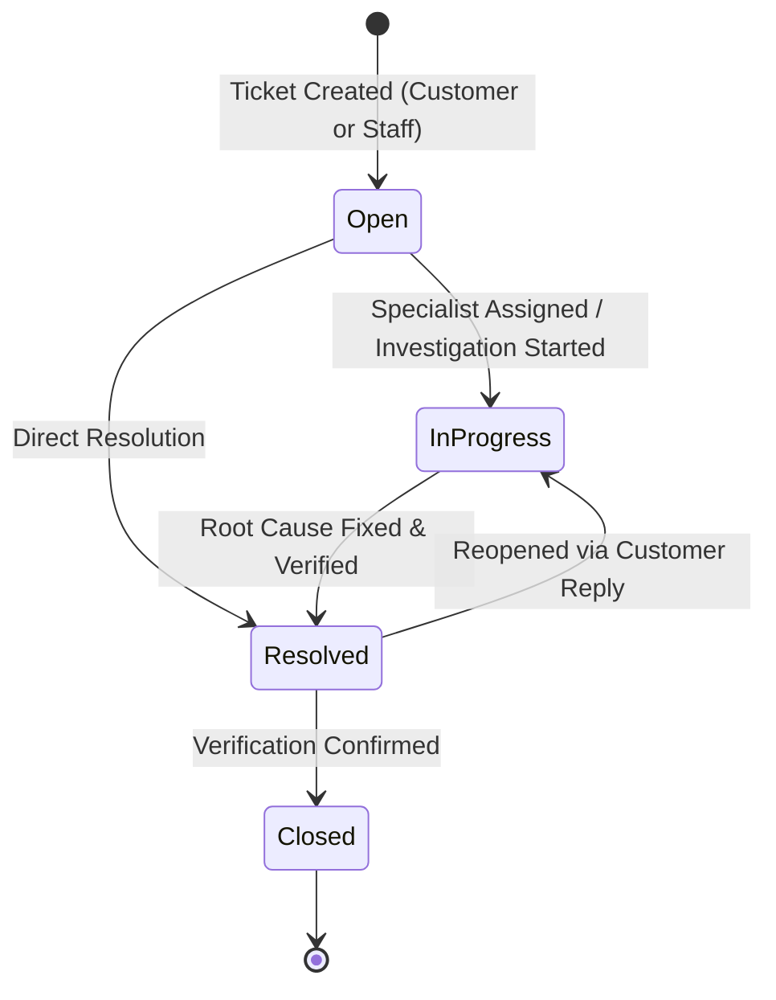
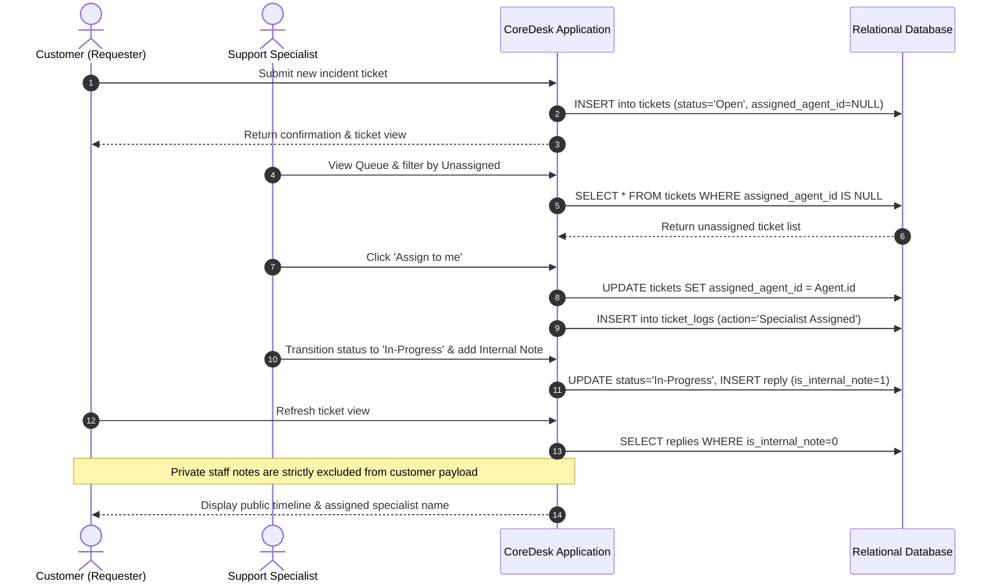

# CoreDesk - Web Helpdesk and Support Ticketing System

> A high-performance, multi-role incident management and customer support ticketing portal engineered in pure Core PHP 8.x, Vanilla JavaScript (ES6+), MySQL, and Apache.
> Built strictly without heavy frameworks (No Laravel, Symfony, or WordPress CMS) to deliver low-level architectural control, raw SQL query optimization, and sub-millisecond execution times.

[](https://php.net)
[](https://www.mysql.com/)
[-f7df1e?logo=javascript&logoColor=black)](https://developer.mozilla.org/en-US/docs/Web/JavaScript)
[](https://httpd.apache.org/)
[](LICENSE)

---

## User Interface & Application Screenshots

### 1. Operations Dashboard
Central queue overview with real-time KPI aggregations, SLA counters, tab filters (All, Open, In-Progress, Critical, Resolved, My Assigned, Unassigned), inline status transition dropdowns, and instant search.



---

### 2. Dual-Pane Ticket Conversation Workspace
Threaded communication panel with author avatars, role badges, customer responses, private staff-only collaboration notes, specialist assignment selector with self-assignment, and an immutable audit trail.



---

### 3. Searchable Ticket Queue Directory
Filterable ticket directory featuring full-text search across ticket codes, subjects, and requester names, along with multi-attribute filtering by Status, Priority, Category, and Assigned Specialist.



---

### 4. Incident Submission Portal
Structured ticket intake form with category selection, priority flags (Low, Medium, High, Critical), reproduction steps input, and specialist assignment routing.



---

### 5. Authentication Portal
SaaS sign-in interface supporting standard password verification and one-click demo profile authenticators for testing Admin, Agent, and Customer roles.



---

## System Architecture & Request Lifecycle



---

## Relational Database Schema

All database tables are normalized in Third Normal Form (3NF) with foreign key constraints, composite indexes, and timestamp auditing.


---

## Incident Lifecycle & Status State Machine



---

## Role-Based Access Control Sequence



---

## Access Control & Permissions Matrix

| Feature | Administrator (`admin`) | Support Specialist (`agent`) | Customer (`customer`) |
|---|---|---|---|
| Incident Dashboard | Full system overview & company KPI metrics | Full system overview & company KPI metrics | Strictly isolated to customer's filed requests |
| Ticket Queue Access | Global company queue | Global company queue | Only customer's own tickets (`WHERE user_id = :uid`) |
| Assign & Reassign Tickets | Full control (assign any specialist or unassign) | Full control (self-assign or reassign) | Blocked (Read-only visibility of designated specialist) |
| Filter by Specialist | Full filter access (Assigned to Me, Unassigned) | Full filter access (Assigned to Me, Unassigned) | N/A (Only sees personal tickets) |
| Status Transition | Full control (Open, In-Progress, Resolved, Closed) | Full control (Open, In-Progress, Resolved, Closed) | Blocked (Customer reply reopens resolved incidents) |
| Public Replies | Can author public responses | Can author public responses | Can author public responses on own tickets |
| Private Internal Notes | Full access (author & view) | Full access (author & view) | Strictly hidden & blocked on backend |
| Cross-Account Isolation | Full inspection privileges | Full inspection privileges | HTTP 403 Forbidden on any foreign ticket |

---

## Project Directory Structure

```text
CoreDesk/
|-- api/                        # RESTful JSON API endpoints
|   |-- add_reply.php           # Post message or internal staff note
|   |-- assign_ticket.php       # Assign/reassign ticket with audit logging
|   |-- metrics.php             # Real-time KPI aggregation counter
|   |-- tickets.php             # Filterable ticket query endpoint
|   `-- update_status.php       # Transactional status updater & audit logger
|-- assets/
|   |-- css/
|   |   `-- style.css           # Clean CSS design system (zero frameworks)
|   |-- js/
|   |   `-- app.js              # Vanilla JS Fetch client, shortcuts & polling
|   `-- screenshots/            # High-resolution application screenshots
|       |-- 01_incident_dashboard.png
|       |-- 02_ticket_conversation.png
|       |-- 03_ticket_queue_directory.png
|       |-- 04_create_ticket.png
|       `-- 05_login_portal.png
|-- config/
|   |-- auth.php                # Session middleware, RBAC guards & CSRF verification
|   `-- database.php            # Native PDO layer with automatic SQLite fallback
|-- database/
|   |-- coredesk.sqlite         # Pre-seeded portable SQLite database
|   `-- schema.sql              # MySQL DDL relational schema with indexes & seed data
|-- includes/
|   |-- footer.php              # Standardized application footer
|   `-- header.php              # Navigation bar, session badges & CSRF meta tags
|-- tests/
|   `-- test_all_roles.php      # 54-assertion multi-role automated test suite
|-- .gitignore                  # Git tracking rules
|-- .htaccess                   # Apache HTTP server security rules & headers
|-- create-ticket.php           # Incident intake portal
|-- index.php                   # Support Operations Dashboard & real-time queue
|-- login.php                   # Authentication portal with 1-click test profiles
|-- logout.php                  # Session destruction & redirect
|-- switch-role.php             # Instant persona switcher for evaluation
|-- ticket-view.php             # Dual-pane conversation thread & audit log
|-- tickets.php                 # Searchable & filterable ticket directory
`-- README.md                   # System documentation & setup guide
```

---

## REST API Specification

| Endpoint | Method | Request Payload | Description |
|---|---|---|---|
| `api/metrics.php` | `GET` | None | Returns JSON object with live counts: `open_count`, `inprogress_count`, `resolved_count`, `critical_count`. |
| `api/tickets.php` | `GET` | `?status=...&priority=...&assigned=...&search=...` | Returns filtered array of tickets with category names, requesters, and reply counts. |
| `api/assign_ticket.php` | `POST` | `{"ticket_id": 1, "agent_id": 2}` | Assigns or unassigns a ticket inside an ACID transaction and writes to `ticket_logs`. |
| `api/update_status.php` | `POST` | `{"ticket_id": 1, "status": "In-Progress"}` | Updates ticket lifecycle state and logs previous vs. new values in `ticket_logs`. |
| `api/add_reply.php` | `POST` | `{"ticket_id": 1, "message": "...", "is_internal_note": 0}` | Posts a customer reply or staff note and returns JSON representation of the new message. |

---

## Local Installation and Setup

### Prerequisites
- PHP 8.0 or higher with `pdo_mysql` or `pdo_sqlite` extension enabled
- MySQL 5.7+ / MariaDB 10.3+ (Optional: portable SQLite activates automatically if MySQL is absent)
- Apache HTTP Server or PHP Built-in Server

### Step 1: Clone the Repository
```bash
git clone https://github.com/dikshadamahe/CoreDesk.git
cd CoreDesk
```

### Step 2: Configure Database (Optional for MySQL)
If utilizing MySQL, create the database and import the relational schema:
```bash
mysql -u root -p -e "CREATE DATABASE coredesk_db CHARACTER SET utf8mb4 COLLATE utf8mb4_unicode_ci;"
mysql -u root -p coredesk_db < database/schema.sql
```

Configure environment variables if using custom database credentials:
```bash
export DB_HOST="127.0.0.1"
export DB_PORT="3306"
export DB_NAME="coredesk_db"
export DB_USER="root"
export DB_PASS="your_password"
```

*Note: If no MySQL credentials are provided, CoreDesk automatically falls back to the embedded SQLite database in `database/coredesk.sqlite`.*

### Step 3: Run the Application
Start the built-in development server:
```bash
php -S localhost:8000
```
Open **http://localhost:8000** in your browser.

---

## Deploy to Render

CoreDesk includes a production `Dockerfile` and a `render.yaml` Blueprint for zero-configuration cloud deployment on Render.

### Option A: 1-Click Blueprint Deployment (Recommended)
1. Go to your [Render Dashboard](https://dashboard.render.com).
2. Click **New +** and select **Blueprint**.
3. Connect your GitHub repository: `dikshadamahe/CoreDesk`.
4. Render will automatically detect `render.yaml` and configure the service as a Docker Web Service on the Free plan.
5. Click **Apply**. Render will build the container and deploy your live public URL (`https://coredesk.onrender.com`).

### Option B: Manual Web Service Setup
1. Go to your [Render Dashboard](https://dashboard.render.com).
2. Click **New +** and select **Web Service**.
3. Connect the repository `dikshadamahe/CoreDesk`.
4. Under **Runtime**, select **Docker**.
5. Set the **Instance Type** to **Free**.
6. Under **Environment Variables**, optionally set `DB_DRIVER` to `sqlite` (or provide MySQL credentials).
7. Click **Create Web Service**. Render builds the image and launches Apache on the dynamically assigned `$PORT`.

---

## Demo Access Profiles

The sign-in page includes one-click role buttons for rapid evaluation:

| Role | Email Address | Password | Permissions & Views |
|---|---|---|---|
| Administrator (Lead) | `admin@coredesk.local` | `password123` | Full administrative oversight, queue management, specialist assignment, and internal notes. |
| Support Specialist | `alex@coredesk.local` | `password123` | Triage assigned tickets, self-assign bugs, author private staff notes, and adjust lifecycle states. |
| Customer (Client) | `rahul@client.com` | `password123` | Submit incidents, track resolution status, and reply directly to support staff. |

---

## Automated Verification Test Suite

Run the comprehensive test suite across all roles and feature sets:
```bash
php tests/test_all_roles.php
```

All 54 assertions test role isolation, CSRF validation, metrics accuracy, ticket assignment, status transitions, and private note concealment.

---

## Security Architecture

- Parameterized SQL Prepared Statements: All queries utilize native PDO prepared statements with `PDO::ATTR_EMULATE_PREPARES => false`.
- Cross-Site Scripting (XSS) Prevention: All dynamic template variables are contextually escaped with `htmlspecialchars(..., ENT_QUOTES, 'UTF-8')`.
- Cross-Site Request Forgery (CSRF) Tokens: State-mutating forms and AJAX requests are validated using cryptographic tokens checked with `hash_equals()`.
- Session Hardening: Cookies are configured with `session.cookie_httponly` and `session.use_only_cookies`.
- HTTP Header Hardening: Protected via `.htaccess` with `X-Frame-Options: SAMEORIGIN`, `X-Content-Type-Options: nosniff`, and directory listing prevention (`Options -Indexes`).

---

## Author and Maintainer

**Diksha Damahe**
- GitHub: [dikshadamahe](https://github.com/dikshadamahe)
- LinkedIn: [dikshadamahe](https://linkedin.com/in/dikshadamahe)
- Email: `dikshadamahe25@gmail.com`
