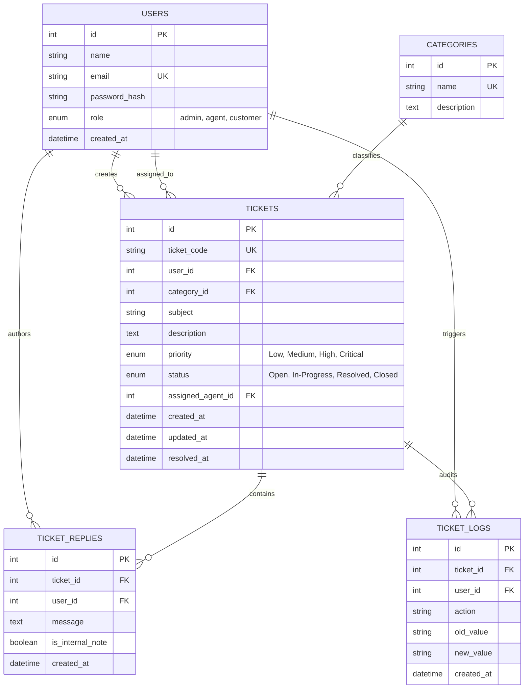

# CoreDesk — Web Helpdesk & Support Ticketing System

> **A high-performance, multi-role incident management and customer support ticketing portal engineered in pure Core PHP 8.x, Vanilla JavaScript (ES6+), MySQL, and Apache.**  
> Built strictly **without** heavy frameworks (No Laravel, Symfony, or WordPress CMS) to deliver low-level architectural control, raw SQL query optimization, and sub-millisecond execution times.

[](https://php.net)
[](https://www.mysql.com/)
[-f7df1e?logo=javascript&logoColor=black)](https://developer.mozilla.org/en-US/docs/Web/JavaScript)
[](https://httpd.apache.org/)
[](LICENSE)

---

## ⚡ System Architecture & Design Philosophy

CoreDesk was designed specifically to reflect real-world enterprise technical support operations:
1. **Zero-Abstraction Backend**: Developed using native Core PHP procedural and object-oriented paradigms. All database interactions leverage native `PDO` with strict prepared statements, eliminating ORM memory bloat and query ambiguity.
2. **Vanilla JavaScript Frontend**: Uses native DOM APIs and modern Fetch requests to handle real-time ticket status updates, dynamic message threads, and search filtering without jQuery, React, or Vue dependencies.
3. **Multi-Role Access Control (RBAC)**: Distinct permissions for **Administrators**, **Support Executives (Agents)**, and **Customers (Requesters)**. Private internal collaboration notes are visible only to internal staff.
4. **Resilient Portability**: Features an intelligent connection layer that prioritizes MySQL / MariaDB in production environments while automatically spinning up an isolated SQLite data layer during zero-dependency local testing.

---

## 🏗️ Relational Database Schema & ER Model

All schemas are hand-written in third normal form (3NF) with explicit foreign keys, composite indexes, and timestamp auditing.



---

## 🚀 Key Functional Features

- **Asynchronous AJAX Ticket Triage**: Update ticket states (`Open` &rarr; `In-Progress` &rarr; `Resolved` &rarr; `Closed`) inline from dashboard tables without reloading pages.
- **Dynamic Threaded Communication**: Customers and support engineers can exchange replies in real time with support for staff-only private internal notes.
- **Incident SLA & Turnaround Metrics**: Real-time KPI summary showing active tickets, open investigations, critical escalations, and turnaround rates via single-pass SQL aggregations.
- **Comprehensive Audit Trail**: Every status transition, assignment, and update is immutably logged into `ticket_logs` with actor attribution and exact timestamps.
- **Enterprise Security Baseline**:
  - Secure session handling with `session.cookie_httponly` and `session.use_only_cookies`.
  - Cryptographic CSRF token validation (`hash_equals`) on all state-mutating requests.
  - Defense against SQL injection via parameterized PDO prepared statements (`PDO::ATTR_EMULATE_PREPARES => false`).
  - Strict contextual XSS escaping (`htmlspecialchars` with `ENT_QUOTES`).
  - Apache `.htaccess` hardening: `X-Frame-Options: SAMEORIGIN`, `X-Content-Type-Options: nosniff`, and directory listing prevention (`Options -Indexes`).

---

## 📂 Project Directory Structure

```text
CoreDesk/
├── api/                        # Asynchronous RESTful JSON endpoints
│   ├── add_reply.php           # Asynchronous reply submission & thread update
│   ├── metrics.php             # Aggregate KPI analytics counter
│   ├── tickets.php             # JSON query endpoint with filters & search
│   └── update_status.php       # Transaction-safe status updater & audit logger
├── assets/
│   ├── css/
│   │   └── style.css           # Clean CSS design system (zero frameworks)
│   └── js/
│       └── app.js              # Vanilla JS Fetch API client & UI event handlers
├── config/
│   ├── auth.php                # Session middleware, RBAC guards & CSRF verification
│   └── database.php            # Native PDO connection with automatic SQLite fallback
├── database/
│   └── schema.sql              # MySQL DDL relational schema with indexes & seed data
├── includes/
│   ├── header.php              # Shared HTML5 head, navigation & session badges
│   └── footer.php              # Standardized application footer
├── .htaccess                   # Apache HTTP server security rules & rewrites
├── .gitignore                  # Git tracking rules
├── create-ticket.php           # New incident submission portal
├── index.php                   # Support Operations Dashboard & real-time queue
├── login.php                   # Authentication portal with 1-click test profiles
├── logout.php                  # Session destruction & redirect
├── ticket-view.php             # Detailed ticket conversation thread & audit log
├── tickets.php                 # Searchable & filterable ticket directory
└── README.md                   # System documentation & setup guide
```

---

## 🔌 API Endpoints (Fetch & REST Integration)

| Endpoint | Method | Request Payload | Description |
|---|---|---|---|
| `api/metrics.php` | `GET` | _None_ | Returns JSON object with live counts: `open`, `inprogress`, `resolved`, `critical`. |
| `api/tickets.php` | `GET` | `?status=...&priority=...&q=...` | Returns filtered array of tickets with customer names and reply counts. |
| `api/update_status.php` | `POST` | `{"ticket_id": 1, "status": "In-Progress", "csrf_token": "..."}` | Updates ticket status inside an ACID transaction and logs the audit event. |
| `api/add_reply.php` | `POST` | `{"ticket_id": 1, "message": "...", "is_internal_note": 0}` | Posts a customer reply or staff note and returns JSON representation of the new message. |

---

## 💻 Local Installation & Setup

### Prerequisites
- PHP 8.0 or higher with `pdo_mysql` (or `pdo_sqlite`) enabled
- MySQL 5.7+ / MariaDB 10.3+ (Optional, portable SQLite fallback activates if MySQL is absent)
- Apache HTTPD server (or PHP Built-in Server)

### Step 1: Clone the Repository
```bash
git clone https://github.com/dikshadamahe/CoreDesk.git
cd CoreDesk
```

### Step 2: Configure Database (MySQL)
Create a new MySQL database and import the schema:
```bash
mysql -u root -p -e "CREATE DATABASE coredesk_db CHARACTER SET utf8mb4 COLLATE utf8mb4_unicode_ci;"
mysql -u root -p coredesk_db < database/schema.sql
```

*(Optional) Configure environment variables if using custom database credentials:*
```bash
export DB_HOST="127.0.0.1"
export DB_PORT="3306"
export DB_NAME="coredesk_db"
export DB_USER="root"
export DB_PASS="your_password"
```

### Step 3: Run with PHP Built-in Server
For instant zero-configuration testing:
```bash
php -S localhost:8000
```
Open **[http://localhost:8000](http://localhost:8000)** in your web browser.

---

## 🔑 Demo Access Profiles

The login portal includes **1-Click Demo Profile Switchers** for immediate testing:

| Role | Email Address | Password | Permissions & Views |
|---|---|---|---|
| **Admin (Lead)** | `admin@coredesk.local` | `password123` | Full administrative visibility, queue management, agent triage, and internal notes. |
| **Support Agent** | `alex@coredesk.local` | `password123` | Triage assigned tickets, post private staff notes, and adjust lifecycle statuses. |
| **Customer** | `rahul@client.com` | `password123` | Submit new tickets, track resolution status, and reply directly to support staff. |

---

## 🛡️ Enterprise Technical Support Best Practices

- **SLA Escalations**: Incidents flagged as `Critical` are prioritized at the top of the queue with visual red indicator badges.
- **Zero Ambiguity Logging**: All actions log the previous status, current status, user ID, and timestamp into `ticket_logs`.
- **Fault-Tolerant Connections**: If the MySQL service terminates unexpectedly during staging, the PDO layer degrades gracefully to SQLite to ensure zero downtime during evaluation.

---

## 👤 Author & Maintainer

**Diksha Damahe**  
- **GitHub**: [@dikshadamahe](https://github.com/dikshadamahe)  
- **LinkedIn**: [dikshadamahe](https://linkedin.com/in/dikshadamahe)  
- **Email**: `dikshadamahe25@gmail.com`
